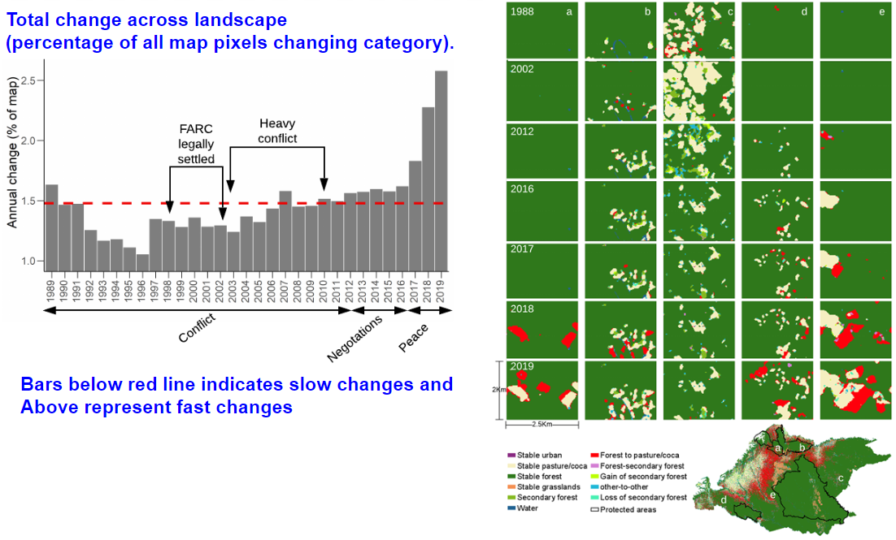
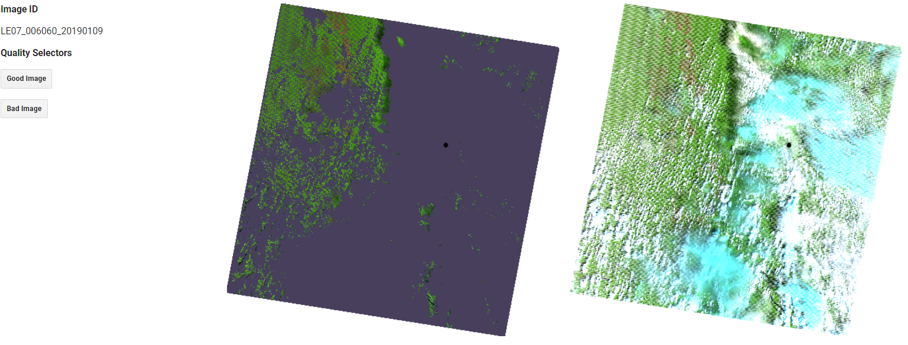
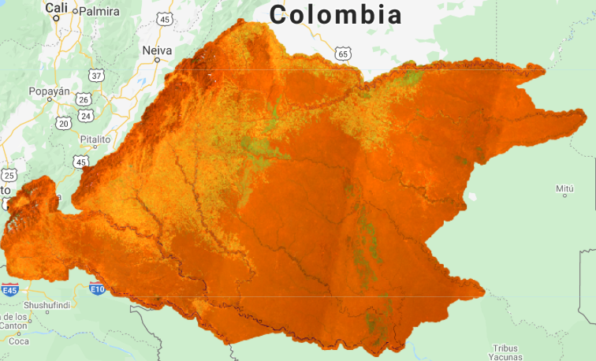

## **Historical land use dynamics during conflict and onset of peace in the Colombian Andes-Amazon region**

Paulo J. Murillo-Sandoval, Emma Gjerdseth, Robert Kennedy, David Wrathall, and Jamon Van Den Hoek, Camilo Correa-Ayram, and Liliana M. Davalos.

## Motivation

The practical use of remote sensing data for making historical land-use maps using well-known change detection algorithms remains poorly applied in tropical countries. Furthermore, National agencies take between 2-3 years to produce land-use maps leading to slow environmental decision-making policies. This is critical when new agrarian policies are implemented for instance after the cessation of armed conflict. Here, we used a set of Landsat predictors which were linearly fitted using LandTrendr to create maps for six classes:

**Urban, Pasture, Forest, Grasslands, Secondary Forest and Water.**

This process is very practical to be applied everywhere and more specifically in forested places in which political conditions might exacerbate land-use quick conversions.

## Results

This figure represent the conversion between different classes. Forest to pasture conversion is moving towards deeper Amazon basin and within protected areas. Conflict points comes from [UCDP](https://ucdp.uu.se) and these point have the higher level of spatial accuracy.

-Annual change is the difference between each pair of consecutive years. Using [Intensity Analysis](www.rdocumentation.org/packages/intensity.analysis/versions/0.1.6link-address) to create that historical plot. 

-The panel image represents different processes occurring in the Andes-Amazon region. 

Columns represent processes and rows years. a) Tinigua protected area, forest class was stable until 2017, and massive conversion to pasture is evident. b) Macarena protected area presented coca relatively stable across time, but new small patches are detecting in 2018 and 2019 mostly associated with coca expansion. c) Miraflorez municipality experienced a shift from pasture/coca to secondary forest. d) Small coca patches in Putumayo are now becoming larger patches of pasture in 2019. e) Giant new pasture patches are moving deeper into the Amazon basin.

## Scripts

1. We used LandTrendr to obtain linearly consistent spectral data for different vegetation indices from 1984-2019. We used NBR as a baseline index for segmentation and the vertex obtained were imposed over a set of spectral metrics. 

   **var ftvList = ['TCW', 'TCG', 'TCB', 'NBR', 'NDFI', 'NDVI','GV_NDFI','SOIL_NDFI','NPV_NDFI', 'NDMI', 'B1', 'B2', 'B3', 'B4', 'B5', 'B7'];**

   We initially removed bad Landsat images using a visual inspection using this code: https://code.earthengine.google.com/2edf4e85c9f471c42b987f5a6b60a8f9. Some Landsat images remains with clouds or strong shadows after fmask procedure. In this example fmask works well.

   

   

   

   After visual inspection, we removed clouds and shadows using fmask, harmonization of Landsat sensors, applied a physical topographic correction, and eliminated Landsat data in an negative buffer of 2Km to avoid problems in the borders. We created annual composites using medoid method using all image within the year. Finally we applied LandTrendr to get fitted values across time, all the code that makes this process is here: https://code.earthengine.google.com/b7da998b6fdb135cd09374403dafbb46

​		Using that code, users can change your baseline index, the list of predictors and the time window of interest i.e. January- 		   		March.   Example of fitted composite for 1990 in our study region:

2. Using the asset created in step 1 and a basemap in 2002 we train a model for six classes. We sampled points in our classes based on the based map and using the spectral+topographic indicators we classify each year. We also used another years to improve training. The code exports annual land-use maps for each year: https://code.earthengine.google.com/7a502e411ef2a35e01eec80d6e554c5f
