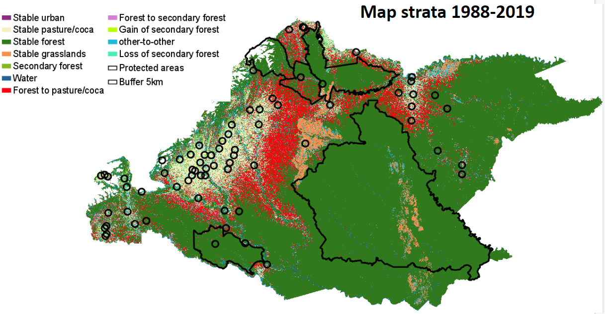

## **Historical land cover dynamics during conflict and post-conflict in the Colombian Andes-Amazon region**

Paulo J. Murillo-Sandoval, Emma Gjerdseth, Robert Kennedy, David Wrathall, and Jamon Van Den Hoek, Camilo Correa-Ayram, and Liliana M. Davalos.

## Motivation

The practical use of remote sensing data for making historical land cover maps using well-known change detection algorithms remains poorly applied in tropical countries. Furthermore, National agencies take between 2-3 years to produce land-use maps leading to slow environmental decision-making policies. This is critical when new agrarian policies are implemented for instance after the cessation of armed conflict. Here, we used a set of Landsat predictors which were linearly fitted using LandTrendr to create maps for six classes:

**Urban**  (urban zones, rock, soils, and sand areas)

**Agriculture** (coca, subsistence ag and pastures)

**Forest** (forested areas > 30% forest cover)

**Grasslands**  (Natural grasslands)

**Secondary Forest** ( Areas that exhibit a consistent forest regrowth trend in a given  period)

and **Water** (water bodies)

This process is very practical to be applied everywhere and more specifically in forested places in which political conditions might exacerbate land cover quick conversions.

## Results

**Figure 1. **. Interval-time intensity analysis results. Red dashed line represents the uniform rate that would exist if total changes followed a uniform annual distribution (A). Forest to pasture conversion is moving towards deeper Amazon basin and within protected areas. Conflict points comes from [UCDP](https://ucdp.uu.se). A total of181 conflict events were used in this analysis which have the highest level of spatial accuracy. Map of differences showing stable and change land cover classes from 1988-2019 across departments within the study area (B).

**Figure 2**. Sankey diagram showing transitions between three main land cover classes (i.e., stable forest, stable agriculture, and secondary forest) during and between conflict and post-conflict periods.

## Scripts

**1. **We used LandTrendr to obtain linearly consistent spectral data for different vegetation indices from 1984-2019. We used NBR as a baseline index for segmentation and the vertex obtained were imposed over a set of spectral metrics. 

**var ftvList = ['TCW', 'TCG', 'TCB', 'NBR', 'NDFI', 'NDVI','GV_NDFI','SOIL_NDFI','NPV_NDFI', 'NDMI', 'B1', 'B2', 'B3', 'B4', 'B5', 'B7'];**

We initially removed bad Landsat images using a visual inspection using this code: https://code.earthengine.google.com/2edf4e85c9f471c42b987f5a6b60a8f9. Some Landsat images remains with clouds or strong shadows after fmask procedure. In this example fmask works well.

After visual inspection, we removed clouds and shadows using fmask, harmonization of Landsat sensors, applied a physical topographic correction, and eliminated Landsat data in an negative buffer of 2Km to avoid problems in the borders. We created annual composites using medoid method using all image within the year. Finally we applied LandTrendr to get fitted values across time, all the code that makes this process is here: https://code.earthengine.google.com/b7da998b6fdb135cd09374403dafbb46

Using that code, users can change your baseline index, the list of predictors and the time window of interest i.e. January- 		March.   Example of fitted composite for 1990 in our study region:

**2.**Using the asset created in step 1 and a basemap in 2002 we train a model for six classes. We sampled points in our classes based on the based map and using the spectral+topographic indicators we classify each year. We also used another years to improve training. The code exports annual land cover maps for each year: https://code.earthengine.google.com/ea6f946ca1a0d29cb71da20aadd99a4e?noload=true